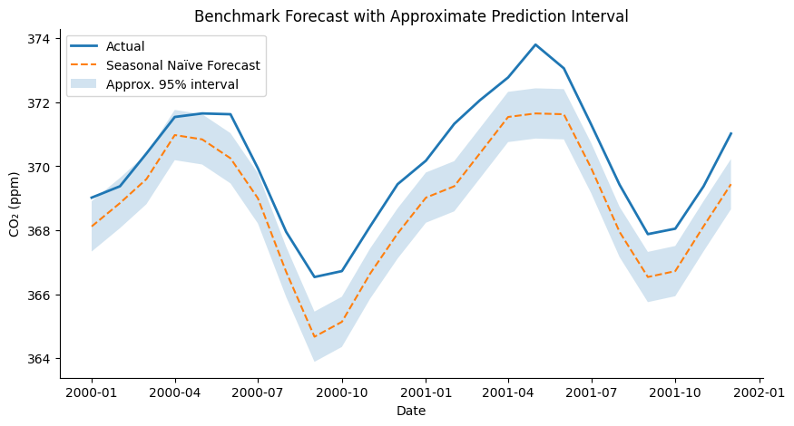
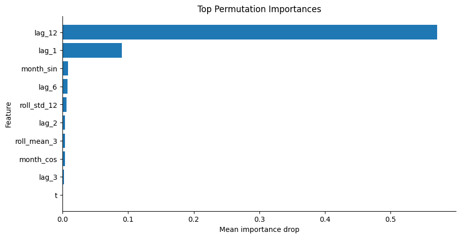
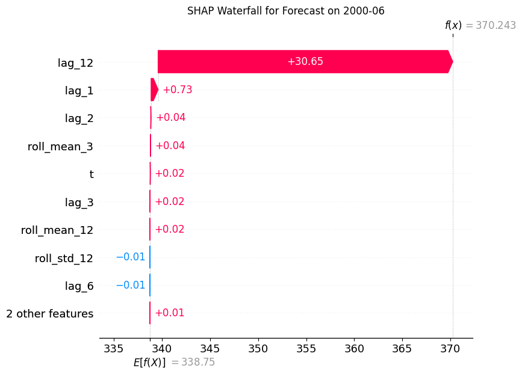

# 📊 Time Series Forecasting with SHAP-Based Model Interpretation

<p align="left">
  
  
  
  
  
</p>

A structured time series forecasting project that combines statistical and machine learning models with explainability techniques to understand how predictions are produced and which features influence model behavior.

---

## 🔍 Project Overview

This project develops a complete forecasting workflow for sequential data and integrates interpretability methods to explain model decisions. It compares multiple approaches, evaluates forecast performance using time-aware validation, and highlights the drivers behind predictions.

---

## ✨ Key Features

- Time-based feature engineering (lags, rolling statistics, trend)
- Forecast benchmarking with proper time series validation
- Combination of statistical and machine learning models
- Model interpretation using SHAP and permutation importance
- Visual diagnostics for performance and residual analysis

---

## 🤖 Models Used

- **Seasonal Naïve Model** – baseline benchmark  
- **SARIMAX** – statistical model capturing trend and seasonality  
- **Random Forest Regressor** – machine learning model for nonlinear patterns  

---

## 🧠 Techniques Applied

- Time series decomposition (trend, seasonality, residuals)  
- Lag feature creation and rolling window statistics  
- Time-based train/test split  
- Time series cross-validation  
- Residual diagnostics and error analysis  
- Permutation feature importance  
- SHAP (SHapley Additive Explanations) for model interpretation  

---

## 📊 Selected Visual Outputs

<p align="center">
  
</p>
<p align="center"><em>Benchmark Forecast with Approximate Prediction Interval</em></p>

<p align="center">
  
</p>
<p align="center"><em>Top Permutation Importances</em></p>

<p align="center">
  
</p>
<p align="center"><em>SHAP Waterfall for Forecast</em></p>

---

## ⚙️ Method Summary

### Data Preparation
The time series is cleaned, indexed, and structured to maintain temporal consistency. Missing values are handled to preserve patterns.

### Feature Engineering
Lag variables, rolling statistics, and time-based encodings are used to capture short-term behavior and recurring seasonal effects.

### Modeling
The project compares baseline, statistical, and machine learning approaches to identify the most effective forecasting method.

### Interpretation
SHAP and permutation importance are used to explain both global feature importance and individual predictions.

---

---

## 🛠️ Technologies Used

- Python  
- Pandas  
- NumPy  
- Matplotlib  
- Scikit-learn  
- Statsmodels  
- SHAP  

---

## 🚀 Running the Project

```bash
git clone https://github.com/your-username/time-series-forecasting-explainability.git
cd time-series-forecasting-explainability
pip install -r requirements.txt
jupyter notebook
```

---

## 📌 Project Value

This project demonstrates that time series models can be evaluated not only by forecast accuracy, but also by how clearly their decisions can be interpreted. This improves transparency and supports better decision-making in real-world applications.
